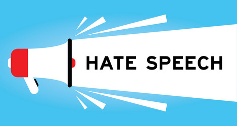
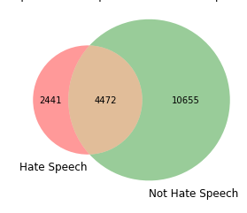
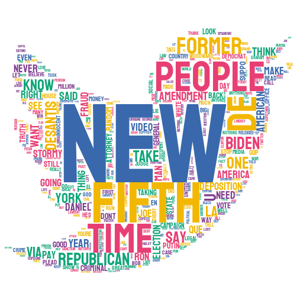

# Hate-speech-identification---Twitter
# Overview

This project aims to identify **hate speech** using *machine learning binary classification algorithms*.
Baseline models included Random Forest, Naive Bayes, Logistic Regression. The final model was a *Logistic Regression* model that used TD-IDF for feature engineering.
It produced an F1 score of 0.75 and Recall of 0.77. Therefore, our goal is to automate hate speech identification, which is a very challenging issue. And while this effort was able to start that process, more work needs to be done to prevent this content from appearing on public venues like Twitter.

**$\color{red}{\text{Warning}}$ : This notebook contains offensive language from the dataset.**

# Data & Methods

The dataset for this capstone project was obtained from Twitter using the snscrape library, which also formatted the raw data for simple understanding. $\color{red}{\text{Here we are taking only past 10000 tweets from date 31/1/2023}}$

Since content moderation is so arbitrary, this dataset's labels were chosen by a public vote and based on majority-rules. Each tweet is assigned a class—0 for hate speech, 1 for foul language, or 2 for neither—in the "class" column. I'll be handling the data as a binary classification challenge in order to develop a distinct project and modify it for my own business environment.

Therefore, the final model will be **predicting whether a tweet is hate speech or not.** In order to prepare the data for this, I will manually replace the existing values of 1 and 2 with 0 and 1 to represent hate speech.

# Sentiment Analysis with TextBlob

TextBlob is a python library used for processing textual data, including sentiment analysis. It provides a simple API for diving into common NLP tasks such as sentiment analysis, part-of-speech tagging, noun phrase extraction, translation, and more.

The sentiment property of TextBlob objects returns a namedtuple of the form (polarity, subjectivity), where polarity is a float between -1 and 1, representing the sentiment of the text **(-1 is negative, 0 is neutral, and 1 is positive)**, and subjectivity is a float between 0 and 1, representing the subjectivity of the text (0 is objective, and 1 is subjective). **To use TextBlob for sentiment analysis, simply create a TextBlob object and call its sentiment property.**

# Feature Engineering

With Natural Language Processing, the purpose of feature engineering is to transform the tokenized text data into numerical vectors that the machine learning algorithm can "understand."

In this notebook, we'll be iterating through three different feature engineering techniques: **Count Vectorization and TF-IDF Vectorization**. Trying out these techniques could yield vastly different metrics on the same four baseline models.

## Train-Test Split
First, let's perform a train-test split of the dataset, where 20% is reserved as unseen testing data.

## TF-IDF Vectorization

First, we’ll be trying one of the most popular methods, TF-IDF Vectorization.

This is an acronym that stands for “Term Frequency — Inverse Document” Frequency which are the components of the resulting scores assigned to each word.
- Term Frequency: This summarizes how often a given word appears within a document.
- Inverse Document Frequency: This down scales words that appear a lot across documents.

Without going into the math, TF-IDF are word frequency scores that try to highlight words that are more interesting, e.g. frequent in a document but not across other documents.

## Evaluation Metrics

For this business problem, **we will use F1 score as the main metric**, while also looking at Precision and Recall. The F1 score finds the harmonic mean between Precision and Recall, and it's useful for data with high class imbalance.

**Overall, we want as much hate speech to flagged as possible** and so that it can be efficiently removed. This means also **optomizing the True Positive Rate**,  Recall.

### Weighted F1 Score

We will also be looking at the weighted F1 score, as it **can account for the class imbalance in labels by calculating metrics for each label**. It finds their average weighted by support (the number of true instances for each label). This results in a F1 score that is not between precision and recall.

# Conclusion :
After analysis all three model the **best f1 score and recall value we are getting in logistic regression model**.

**F1 score : 0.75\
recall   : 0.77**

over all we are getting 2441 unique hate speech word in our data set.
This model will help to idetentify hate speech tweet easily.
word like criminal ,fraud, bad and many more are most occuring word in hate speech  in this data set.

